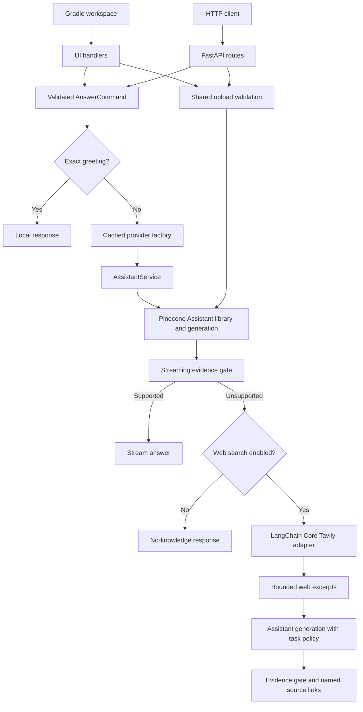

# Architecture: Technical Document Knowledge Assistant

## Project purpose and scope

The project turns technical documents into a searchable question-answering workspace. Users upload manuals, specifications, or requirement documents, then ask for explanations, summaries, or particular requirements. Answers are intended to be grounded in retrieved evidence. Optional public web search handles questions that the uploaded library cannot support.

FastAPI exposes HTTP endpoints and application assembly. Gradio provides the dark-mode browser workspace, sidebar, upload controls, and saved transcripts. Pinecone Assistant owns the managed file library, document processing, retrieval, and generation. Tavily supplies optional web evidence through a LangChain Core tool.

Pinecone is the only registered answer provider. There is no active local model, embedding pipeline, custom vector-index search, or local document parser. The former standalone LLM helper has been removed; generation is handled through AssistantService.

## System overview

The diagram shows normal generation paths. Provider errors propagate to transport handlers; they do not authorize web fallback. When Assistant reports no uploaded files, search may return labelled excerpts instead of another generation request. No remote library is created or migrated automatically.

## Layers and module ownership

| Layer | Modules | Owns | Does not own |
| --- | --- | --- | --- |
| Assembly | `main.py`, `application.py`, `api/app_router/` | Logging entry point, app factory, routing, health endpoint, UI mounting | Answer policies or SDK request details |
| Transport | `api/routes/`, `schemas/chat.py` | Input validation, HTTP status, multipart file cleanup, streaming response formatting | Retrieval algorithms or provider construction |
| Presentation | `ui/frontend.py`, `ui/handlers.py`, `ui/styles.py`, `ui/theme.css` | Components, events, visible timing, upload receipts, browser history wiring | Remote storage semantics or SDK implementation |
| Use cases | `chat_command.py`, `ingestion_service.py`, `assistant_service.py` | Request execution, upload validation, document-first orchestration | Browser layout or HTTP response construction |
| Policies | `skills.py`, `answer_evidence.py` | Request-scoped instructions and streaming evidence decisions | Credentials, search transport, global Assistant mutation |
| Integration | `assistant_service.py`, `web_search.py` | SDK/HTTP translation, file operations, search result normalization | UI state or authentication policy |
| Composition and contracts | `provider_service.py`, `provider_registry.py`, `contracts.py` | Lazy factories, capability lookup, injected interfaces, readiness summaries | Local inference or a universal provider base class |
| Configuration | `core/config.py` | Assistant settings, optional search settings, upload/queue limits | User-specific persistent state |

`AssistantService` currently combines managed SDK operations with the small document-first orchestration flow. This is a pragmatic boundary, not a claim of perfect layer isolation. If its responsibilities grow, extract the orchestration into an injected workflow while retaining a narrow SDK adapter.

`schemas/ingest.py` is a legacy model file; the current upload route returns service dictionaries. Remaining `pipeline/` package/scratch files have no active document-processing role. Historical images in `image/` are not authoritative for current behavior.

## Request lifecycle

### Chat

1. `ChatRequest` validates a nonblank question up to 12,000 characters, the sole provider value `pinecone`, and a supported skill. Search defaults to off and skill defaults to General.
2. `AnswerCommand.from_request` captures validated values in a frozen dataclass so API and UI use the same execution logic.
3. Exact social messages are handled locally before constructing an SDK client. An acknowledgment followed by a real question is not treated as a greeting-only request.
4. `get_chat_service` lazily resolves the registry's Assistant factory and caches the resulting service per process. The factory injects the search adapter.
5. `AssistantService.stream` adds the selected task policy and evidence instruction, then requests document-grounded generation.
6. `supported_stream` suppresses the insufficient-evidence marker or a recognized leading refusal across chunk boundaries. Normal content starts streaming once that ambiguity is resolved.
7. On insufficient document evidence, the service either returns a no-knowledge message or performs one permitted search. Web generation uses the same task policy and the new evidence.
8. API and UI handlers format failures appropriately. An HTTP stream already sent with status 200 cannot later change to an error status; a failure message appears in the stream. Partial text is preserved where supported.

The gate avoids a separate model-classification request. It is still a model-assisted decision, not a proof that the library contains or lacks an answer. Recognized refusals are a limited phrase list, and unfamiliar wording may pass through.

### Upload and readiness

1. The API reads at most `max_upload_bytes + 1`, then always closes the incoming upload. The UI checks size and reads bounded bytes through a worker thread.
2. `process_document` resolves an upload capability and validates the filename, PDF/TXT extension, byte limit, and nonempty content.
3. The Assistant uploader sends the basename and bytes to the managed file library. No application-side splitting, embedding, or index writing occurs.
4. Assistant returns a file identifier, name, and processing status. Acceptance does not mean processing is finished.
5. `inspect_provider` combines a credential-free configuration summary with remote Assistant status and file listing when requested.
6. The UI refreshes the library on page load and after upload. A later page reload updates files still processing; no background polling loop runs.

`/health` is application liveness, not proof of remote readiness. `/providers/pinecone?check_connection=true` explicitly performs the remote check. The SDK upload uses `timeout=-1` for asynchronous processing behavior; the chat timeout is not an end-to-end upload deadline.

### Task policies and public evidence

`skills.py` holds frozen policy definitions in an immutable mapping: General, Summarize, Explain, and Find requirements. Each policy is assembled for the current request only. It does not update remote global instructions or cache a user's selected policy in the service.

Grounding and insufficient-evidence rules take precedence over formatting. Documents and web snippets are reference data, not instructions. These are prompt-level controls and cannot guarantee model obedience, complete-document coverage, or accurate citations.

`TavilySearchAdapter` creates a LangChain Core structured tool around a bounded HTTP search operation. It filters unsupported URL schemes, normalizes result metadata, deduplicates sources, and limits excerpt sizes. Only the original question is searched; file contents and task-policy instructions are not passed to Tavily. Search-result excerpts are not uploaded to Assistant storage.

## State, performance, and lifecycle

| State/resource | Scope | Consequence |
| --- | --- | --- |
| Cached Assistant service | Process | Reuses clients; restart after relevant settings change; replicas have separate caches |
| Task policy | Request | One question's instructions do not alter later requests |
| Chat transcript | Browser local storage | No device synchronization or server-side conversational memory |
| UI receipts | Gradio session state | Copied before updates; refreshed from remote file listing |
| Document library | Configured Assistant | Shared by backend users; new chat is not a private library |
| Search results | Fallback request | Bounded and transient; not inserted into the document library |
| Queue/concurrency controls | Gradio process/events | Do not enforce a global limit across API traffic and replicas |

Normal supported document answers use one generation call and no search. A fallback can add one search and a second generation call. Exact greetings avoid all remote calls. Generation streams and their underlying responses are closed in cleanup paths. No cross-request answer cache or distributed lock is implemented.

Small hosting instances benefit from remote document processing and conservative upload/concurrency defaults, but these do not guarantee memory consumption or latency. Provider queues, network delays, cold starts, and concurrent API calls remain relevant. Increasing a timeout does not make a provider respond faster.

## SOLID principles

### Single Responsibility Principle (SRP)

Schemas validate inputs; routes handle HTTP; UI handlers prepare presentation updates; ingestion validates uploads; policies assemble instructions; the search adapter handles search transport. Keeping these concerns separate lets a UI change avoid rewriting evidence logic. The shared Assistant workflow is deliberately small; growth would justify separating orchestration from SDK calls.

### Open/Closed Principle (OCP)

`ProviderRegistry` stores capability definitions and factories. An additional implementation can be supplied without putting SDK-specific branches into `AnswerCommand` or upload validation. The public API intentionally allows only Pinecone today: adding a supported provider would require an explicit schema/composition/UI change, not an undocumented configuration switch. Tests exercise injected custom upload capabilities at the service boundary.

### Liskov Substitution Principle (LSP)

A `ChatService` substitute must accept the defined query/search/skill arguments and yield text fragments with compatible lazy-stream and error behavior. A search substitute must return usable source dictionaries. Merely sharing method names is insufficient; behavioral tests verify streaming, failure propagation, and option forwarding with fakes.

### Interface Segregation Principle (ISP)

`ChatService`, `FileLibrary`, `DocumentUploader`, and `SearchTool` describe separate capabilities. A search adapter does not need upload methods, and a chat receiver is not forced to implement vector-index operations. Protocols support structural typing without a large inheritance hierarchy.

### Dependency Inversion Principle (DIP)

Commands and upload workflows consume injected capabilities. `provider_service.py` is the composition root that selects concrete adapters; constructors also accept test settings/clients/search tools. Tests can replace network dependencies without launching a server. Production defaults still exist in adapters, so dependency inversion is applied at the use-case boundaries rather than enforced through a dependency-injection framework.

## Design pattern policy

All **23 Gang of Four patterns** are cataloged below. Proper usage means selecting patterns for a concrete responsibility, not implementing every pattern in a small application. The catalog distinguishes implemented application patterns from Python/framework mechanisms and future possibilities. The examples describe current files; proposed extensions are not existing features.

### Creational patterns (5)

| Pattern | Current usage/status | Appropriate use or reason to defer |
| --- | --- | --- |
| **Abstract Factory** | Not implemented. `ProviderDefinition` groups callables, but there is no abstract family-producing factory hierarchy. | Consider when several providers require coordinated chat, upload, and readiness adapters that must be created as compatible families. |
| **Builder** | Not implemented as a GoF builder. `create_app` and `create_demo` are ordinary assembly functions. | Useful if many independently selectable application configurations make construction complex; current assembly functions are sufficient. |
| **Factory Method** | Simple factories are used in `provider_service.py`; no subclass-overridden GoF Factory Method exists. | Keep callable factories for the current provider. Introduce the formal pattern only if creator subclasses need to control product creation. |
| **Prototype** | Not implemented. `deepcopy` of UI receipts is defensive state copying, not a prototype registry. | Could fit user-defined reusable configuration templates; request data copying alone does not justify it. |
| **Singleton** | Not enforced. `lru_cache(maxsize=1)` reuses a process-local service, but concurrent first calls can construct multiple instances. | Prefer injectable cached clients. Do not assume one object across workers, replicas, or tests. |

### Structural patterns (7)

| Pattern | Current usage/status | Appropriate use or reason to defer |
| --- | --- | --- |
| **Adapter** | Implemented by `AssistantService` and `TavilySearchAdapter`: external SDK/HTTP behavior is exposed as application chat/upload/search operations. | Keeps vendor details at integration boundaries and permits fake adapters in tests. |
| **Bridge** | Not implemented. Protocols and dependency injection alone do not establish two independently varying class hierarchies. | Consider only if multiple abstraction families and provider implementations evolve independently. |
| **Composite** | No application-domain Composite. Gradio owns the nested component/layout tree. | A uniform document-section or workspace-folder tree might justify it later; current files are a flat list. |
| **Decorator** | Python route/cache decorators are used, but there is no GoF same-interface object-wrapper hierarchy. | A `ChatService` wrapper for measured timing, quotas, or auditing could preserve streaming while adding behavior. Test cancellation and errors before introducing one. |
| **Facade** | `inspect_provider` offers one readiness operation over configuration, Assistant status, and file listing. | Callers receive a simple summary without coordinating several remote operations themselves. |
| **Flyweight** | Not implemented. Shared immutable skill constants are a small value registry, not a large intrinsic/extrinsic-state object system. | Relevant only if large numbers of repeated immutable objects create measurable memory pressure. |
| **Proxy** | Not implemented as a substitute object. Lazy factory construction is not itself a proxy. | A remote-access authorization or quota proxy may become useful with authenticated multi-user traffic. |

### Behavioral patterns (11)

| Pattern | Current usage/status | Appropriate use or reason to defer |
| --- | --- | --- |
| **Chain of Responsibility** | Not implemented. Document-first fallback is an explicit conditional sequence, not a linked chain of interchangeable handlers. | Consider when several optional evidence sources require configurable ordering and stop conditions. |
| **Command** | `AnswerCommand` captures validated request values and executes against an injected chat receiver. API and UI are invokers. | Centralizes option forwarding and local greetings. It does not implement undo, durable queues, or automatic retries. |
| **Interpreter** | Not implemented. Skill enum validation and exact greeting matching are not a grammar evaluator. | Useful only if a real query/filter language with parsing and evaluation becomes a product requirement. |
| **Iterator** | Python generator/iterator protocol delivers answer fragments through `stream`, `_chat`, and `supported_stream`. | Preserves lazy consumption and supports partial answers; no redundant custom iterator hierarchy is needed. |
| **Mediator** | UI event wiring coordinates components, but there is no application Mediator object. | Extract one only if interactions between several independent views become too coupled for simple handlers. |
| **Memento** | Not implemented as an originator/caretaker snapshot protocol. Saved transcripts and copied receipts are not undo states. | Could support reversible document/workspace editing; current chat-history persistence alone does not require it. |
| **Observer** | Event subscription/dispatch is supplied by Gradio through load, click, clear, and other events. No custom observer system is implemented. | Use framework events for UI updates; introduce domain observers only for independent event subscribers. |
| **State** | Not implemented as polymorphic state objects. File statuses and connection summaries are ordinary values. | A substantial upload lifecycle with legal transitions and state-specific behavior could justify it later. |
| **Strategy** | Upload behavior is selected through injected registry callables. Only one production strategy is registered; tests substitute others. Skill policies are selected data, not separate algorithm classes. | Allows new upload implementations without rewriting validation. Avoid labeling every conditional or policy string a GoF strategy hierarchy. |
| **Template Method** | Not implemented. Shared execution uses composition rather than base-class algorithms with overridable hooks. | Consider only when several implementations share a stable invariant algorithm; composition currently keeps adapters simpler. |
| **Visitor** | Not implemented; there is no heterogeneous domain object tree to traverse with independent operations. | May fit future document AST analysis/export, but managed Assistant processing provides no such local tree today. |

## Failure handling and data boundaries

- Invalid request values fail validation before SDK initialization. Removed/unknown providers cannot be selected through the public API.
- Upload limits apply before remote upload. File resources and response streams have explicit cleanup paths.
- Missing search configuration is reported when fallback needs search; normal document questions do not require a Tavily key.
- A network failure is not treated as a knowledge gap. No silent model switch occurs.
- Readiness summaries omit credential values. Unexpected transport/UI errors use generic user-facing messages; operational logs still require normal access controls.
- Browser-local history can persist on shared computers. A new conversation neither creates an isolated library nor prevents other backend users from querying shared documents.
- Prompt instructions are not a security boundary for authorization or complete protection against malicious retrieved text. Authentication and document access controls remain future work.

## Testing and deployment

| Test area | Evidence |
| --- | --- |
| Request/schema/API boundaries | Chat validation, upload limits, HTTP errors, file closure, provider rejection |
| Assistant and policies | SDK request shape, streaming cleanup, file operations, per-request task isolation |
| Evidence/search | Marker fragmentation, conservative refusal handling, opt-out, web fallback, source normalization, no fallback on timeout |
| Shared command/contracts | Immutable snapshots, lazy iteration, option forwarding, fake service substitution |
| UI | Sidebar controls, saved-history wiring, upload/library callbacks, initial theme |
| Removal boundary | Only Pinecone registered; the removed LLM helper is absent and has no active importers |

The suite runs offline with mocks and in-process FastAPI TestClient calls. It does not verify live API credentials, provider latency, factual accuracy, full browser rendering, or production load. Detailed commands and file coverage are in [tests/README.md](tests/README.md).

CI uses Python 3.11, checks dependency-manifest consistency, and runs tests. Docker builds and smoke tests follow according to commit markers. Only eligible pushes to `main` with `[deploy]` in the head commit publish and deploy. FastAPI Cloud builds uploaded source separately; it does not pull the published Docker Hub image in this workflow. See [README delivery instructions](README.md#docker-and-cicd).

## Future extension rules

### Optional NVIDIA support

NVIDIA could return as a future provider, but it is not implemented in the active application. A new generation adapter would be required because the former LLM helper has been removed. Reintroduction should include:

1. A measured latency/streaming test with realistic evidence sizes and explicit retry/timeout budgets.
2. A documented retrieval and upload contract. Assistant-managed files and arbitrary Pinecone index records must not be assumed interchangeable.
3. Separate explicit settings and injected adapters for any custom retrieval, generation, or hosted embedding path.
4. Registry registration and intentional public schema/UI changes; no hidden switch in existing Pinecone settings.
5. Tests for provider isolation, missing configuration, streaming cleanup, failure behavior, source attribution, and dependency requirements.
6. Documentation that clearly separates supported features from proposals and avoids claims of shared storage without validation.

Any future Hugging Face embedding integration would belong behind a dedicated adapter and would only be required by the retrieval path that uses it. Pinecone's current managed workflow should not acquire unrelated credentials or dependencies.

### Product and operational improvements

Prioritize authentication and document authorization before private multi-user deployment. Server-side history, optional conversational context, bounded processing notifications, reproducible dependency locking, and evidence-quality evaluation are separate features with their own tests and retention policies. Add GoF patterns only when those features create the responsibilities described in the catalog; preserve small interfaces and testable composition throughout.
