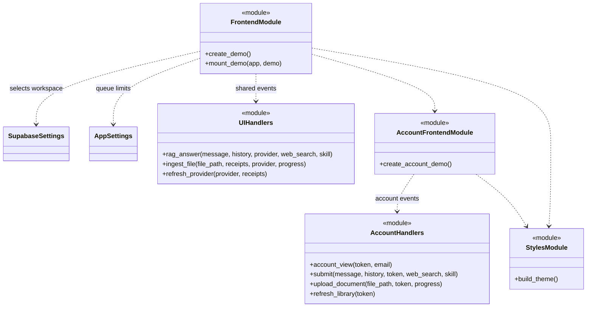
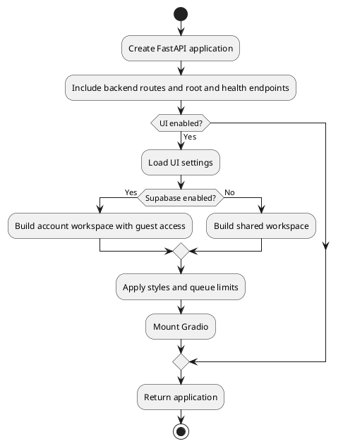

```mermaid
classDiagram
    class FrontendModule {
        <<module>>
        +create_demo()
        +mount_demo(app, demo)
    }
    class AccountFrontendModule {
        <<module>>
        +create_account_demo()
    }
    class UIHandlers {
        <<module>>
        +rag_answer(message, history, provider, web_search, skill)
        +ingest_file(file_path, receipts, provider, progress)
        +refresh_provider(provider, receipts)
    }
    class AccountHandlers {
        <<module>>
        +account_view(token, email)
        +submit(message, history, token, web_search, skill)
        +upload_document(file_path, token, progress)
        +refresh_library(token)
    }
    class StylesModule {
        <<module>>
        +build_theme()
    }
    class SupabaseSettings
    class AppSettings
    FrontendModule ..> SupabaseSettings : selects workspace
    FrontendModule ..> AppSettings : queue limits
    FrontendModule ..> UIHandlers : shared events
    FrontendModule ..> AccountFrontendModule
    FrontendModule ..> StylesModule
    AccountFrontendModule ..> AccountHandlers : account events
    AccountFrontendModule ..> StylesModule
```

```plantuml
@startuml
start
:Create FastAPI application;
:Include backend routes and root and health endpoints;

if (UI enabled?) then (Yes)
    :Load UI settings;
    if (Supabase enabled?) then (Yes)
        :Build account workspace with guest access;
    else (No)
        :Build shared workspace;
    endif
    :Apply styles and queue limits;
    :Mount Gradio;
endif

:Return application;
stop
@enduml
```